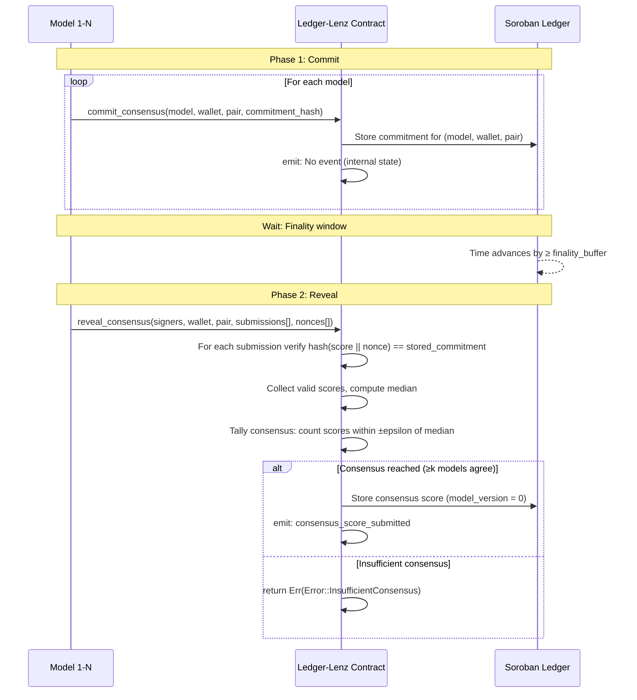
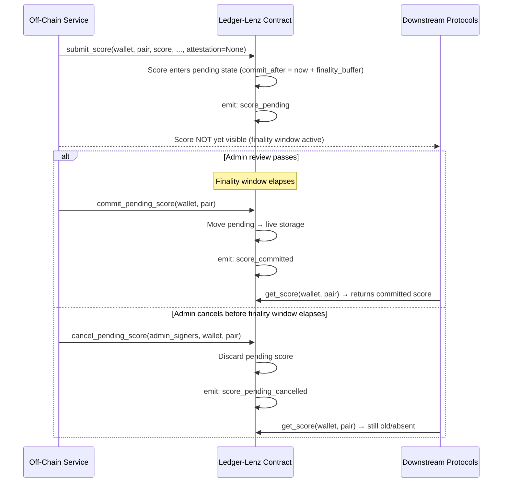
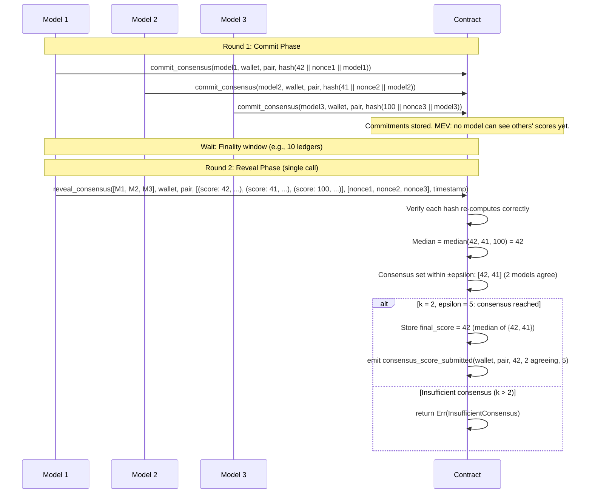
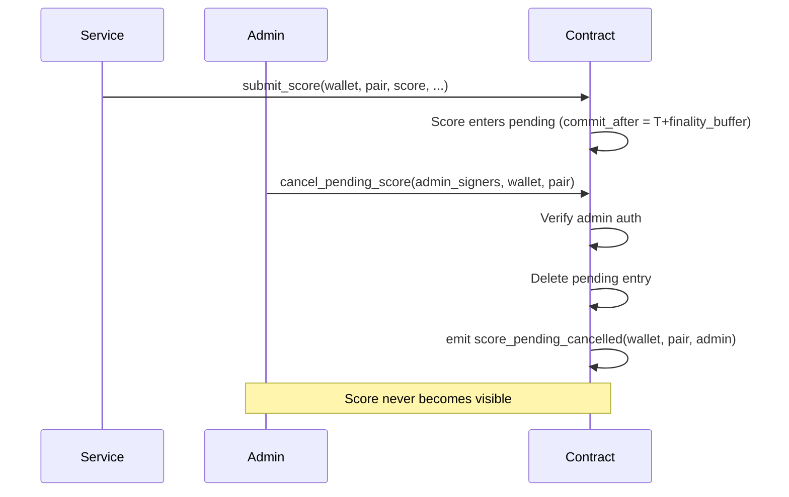

# Commit-Reveal Score Submission Flow

## Overview

LedgerLens employs a commit-reveal pattern to prevent MEV (maximum extractable value) attacks during multi-model consensus scoring. This pattern is used in the consensus submission flow where multiple independent models submit their risk assessments: during the commit phase, models publish commitments (cryptographic hashes) of their scores without revealing the actual values; only after all commitments are recorded on-chain does the reveal phase begin, where the actual scores are published and verified against their commitments. This two-phase structure prevents models from observing each other's submissions and adjusting their own to game the final consensus value.

## Happy Path — Normal Consensus Flow

## Finality Buffer (Pending Score Commit Window)

When `submit_score` is called with a `finality_buffer > 0`, the score is held in a pending state instead of taking effect immediately. This is a separate administrative flow from consensus commit-reveal, used to allow admins to review and cancel suspicious scores before they become visible to downstream protocols.

## Multi-Model Consensus Commit-Reveal (MEV-Resistant)

For consensus scoring, the flow is:

1. **Commitment Phase**: Each model's `commit_consensus()` call sends `commit(score || nonce || model_id)` to the contract.
2. **Finality Window**: Some time must pass before reveal is allowed (determined by the network's confirmation time).
3. **Reveal Phase**: Call `reveal_consensus()` with the full list of submissions and nonces. The contract re-computes each commitment hash and verifies it matches the stored commitment for that model.
4. **Tally**: Once all commitments are verified, the contract computes the median score and checks if at least `k` models are within `±epsilon` of that median.

### Sequence Diagram: Multi-Model Consensus

## Admin Cancel Path

An admin can unilaterally cancel a pending score (from the finality buffer) at any time before the finality window has elapsed. This is the administrative escape hatch for catching erroneous submissions.

## Consensus Commit-Reveal No-Op Cases

- **Commitment exists but reveal never called**: The commitment remains stored until its TTL expires (see `ESCALATION_BREACH_TTL_EXTEND_TO` for the default TTL refresh strategy). No active cleanup is required.
- **Wrong nonce in reveal**: The re-computed hash will not match the stored commitment, triggering `Error::CommitmentMismatch`.
- **Timestamp is 0 or out of staleness window**: Rejected with `Error::InvalidTimestamp`.
- **Submissions and nonces length mismatch**: Rejected with `Error::CommitmentMismatch` (signal for desynchronization).

## Function Reference

| Function | Phase | Auth Required | Description |
|----------|-------|---------------|-------------|
| `submit_score` | Finality Buffer | Service | Submits a regular score; held pending if finality_buffer > 0 |
| `commit_pending_score` | Finality Buffer | None (time-gated) | Moves pending score to live storage once finality window elapses |
| `cancel_pending_score` | Finality Buffer | Admin | Discards a pending score before the finality window elapses |
| `commit_consensus` | Consensus Phase 1 | Model | Submits a consensus score commitment (hashed) |
| `reveal_consensus` | Consensus Phase 2 | Service Signers | Reveals scores, verifies commitments, tallies consensus |

**Source:** [contracts/ledgerlens-score/src/lib.rs](../../contracts/ledgerlens-score/src/lib.rs)

## Security Notes

### Finality Buffer

- The finality buffer is an optional administrative review window; it does **not** affect the security of individual attestations (which use off-chain secp256k1 signatures).
- Once committed, a score's commit timestamp is immutable and part of the stored `RiskScore`.
- The admin may cancel a pending score at any time before finality, but once committed it cannot be reverted without submitting a new score.

### Consensus Commit-Reveal

- **Nonce Reuse**: Each nonce must be unique per model per (wallet, asset_pair) to prevent commitment collision attacks. The off-chain orchestrator must ensure nonces are drawn from a cryptographically random source and never reused.
- **Commitment Hash Format**: The hash must be computed as `sha256(score || nonce || model_id || wallet || asset_pair || contract_id)` to bind it to a specific proposal context. The exact byte-ordering is defined in `contracts/ledgerlens-score/src/verkle.rs`.
- **Finality Window**: Even within consensus, a finality window (determined by network confirmation time) must pass between the commit and reveal phases. This prevents models from observing each other's commitments on-chain and adjusting their reveals.
- **Median Stability**: The consensus implementation uses integer division for the median to ensure deterministic results across different ledger environments.

## Known Limitations and Future Work

- **No multi-stage consensus**: Consensus is currently single-round. A multi-stage Byzantine voting protocol is not yet implemented (see #XXX for future enhancement).
- **Fixed epsilon and k**: The consensus threshold parameters (`epsilon`, `k`) are currently global; per-pair tuning is not yet supported.
- **No partial consensus recovery**: If some models fail to reveal, the entire proposal fails. A majority-recovery mode is a candidate enhancement.
