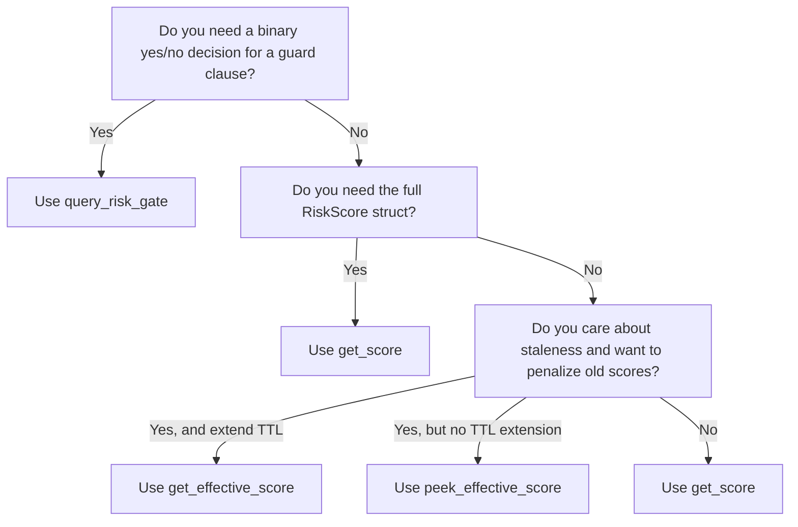

# Score Query Function Decision Guide

## Overview

LedgerLens exposes multiple query functions for different use cases. Choosing the wrong one has consequences for gas cost, correctness, and staleness tolerance. This guide shows you how to pick the right function.

- **`get_score`** → Latest raw score, extends TTL, fails with error if not found
- **`get_effective_score`** → Score with staleness filtering applied, extends TTL, fails with error if not found or embargoed
- **`query_risk_gate`** → Boolean gate check, side-effect free, infallible, conservative on unknowns
- **`peek_effective_score`** → Score preview without side effects, no TTL extension, returns Option

---

## Comparison Table

| Aspect | `get_score` | `get_effective_score` | `query_risk_gate` | `peek_effective_score` |
|--------|-------------|----------------------|-------------------|------------------------|
| **TTL Extension** | ✓ | ✓ | ✗ | ✗ |
| **Embargo Check** | ✗ | ✓ (Error) | ✓ (false) | ✓ (Option::None) |
| **Staleness Filter** | ✗ | ✓ | ✗ | ✓ |
| **Returns** | `Result<RiskScore>` | `Result<EffectiveRiskScore>` | `bool` | `Option<EffectiveRiskScore>` |
| **Infallible** | ✗ | ✗ | ✓ | ✓ |
| **Side-Effect Free** | ✗ | ✗ | ✓ | ✓ |
| **Typical Use Case** | Full diagnostics | Risk-aware scoring | Production guard clauses | Off-chain preview |

---

## get_score

**Signature:**
```rust
fn get_score(env: Env, wallet: Address, asset_pair: Symbol) -> Result<RiskScore, Error>
```

**What it does:**
- Retrieves the latest raw risk score for `(wallet, asset_pair)`.
- Extends the score's TTL on read (bumps remaining lifetime).
- Returns the full `RiskScore` struct: `score`, `benford_flag`, `ml_flag`, `timestamp`, `confidence`, `model_version`.

**When to use:**
- You need the full score struct (confidence, model version, flags) for diagnostics.
- You are willing to handle `Err(ScoreNotFound)` if the score doesn't exist.
- You don't care about staleness and want the raw stored value.
- You are in a write path or a low-frequency query where TTL extension cost is acceptable.

**When NOT to use:**
- Inside a swap guard clause → use `query_risk_gate` instead (cheaper, infallible).
- For read-heavy loops → TTL extension is expensive; use `peek_effective_score`.
- When you care about score staleness → use `get_effective_score` instead.

**Example:**
```rust
match client.get_score(&user, &symbol_short!("XLM_USDC")) {
    Ok(score) => {
        // You have the full struct
        println!("Score: {}, Confidence: {}, Flags: {:?}",
            score.score, score.confidence, (score.benford_flag, score.ml_flag));
        if score.confidence < 50 {
            // Low confidence → treat as unreliable
            return Err(MyError::LowConfidence);
        }
    }
    Err(Error::ScoreNotFound) => {
        // No score exists for this wallet/pair
        return Err(MyError::UnknownWallet);
    }
    Err(e) => return Err(MyError::SystemError(e)),
}
```

---

## get_effective_score

**Signature:**
```rust
fn get_effective_score(
    env: Env,
    wallet: Address,
    asset_pair: Symbol,
) -> Result<EffectiveRiskScore, Error>
```

**What it does:**
- Retrieves the latest raw score and applies staleness filtering.
- If the score is older than the configured staleness window (default: 7 days), it applies an exponential decay to penalize old data.
- Extends TTL on read (like `get_score`).
- Checks embargo status and returns `Err(ScoreEmbargoed)` if the wallet is on the blacklist.
- Returns `EffectiveRiskScore` with fields: `raw_score`, `effective_score`, `decay_applied`, `decay_factor`.

**When to use:**
- You want to penalize wallets with stale scores (score older than the staleness window).
- You need to detect embargoed wallets and fail explicitly.
- You are in a risk-aware decision path where a 7-day-old score should decay.
- TTL extension cost is acceptable (you're not in a read-heavy loop).

**When NOT to use:**
- Inside a guard clause → use `query_risk_gate` (simpler, infallible).
- For immediate yes/no decisions without diagnostics → use `query_risk_gate`.
- In read-heavy loops → TTL extension is expensive; use `peek_effective_score`.

**Example:**
```rust
match client.get_effective_score(&user, &symbol_short!("XLM_USDC")) {
    Ok(eff) => {
        // eff.effective_score may differ from eff.raw_score if decay was applied
        if eff.decay_applied {
            println!("Score has decayed: {} → {}", eff.raw_score, eff.effective_score);
        }
        if eff.effective_score >= 75 {
            return Err(MyError::UserTooRisky);
        }
    }
    Err(Error::ScoreEmbargoed) => {
        // Wallet is on the embargo blacklist
        return Err(MyError::WalletEmbargoed);
    }
    Err(Error::ScoreNotFound) => {
        // No score exists; apply your fallback (e.g., reject)
        return Err(MyError::NoScore);
    }
    Err(e) => return Err(MyError::SystemError(e)),
}
```

---

## query_risk_gate

**Signature:**
```rust
fn query_risk_gate(
    env: Env,
    wallet: Address,
    asset_pair: Symbol,
    gate_threshold: u32,
) -> bool
```

**What it does:**
- Returns `true` if `score < gate_threshold` (wallet is safe).
- Returns `false` if the score is missing, embargoed, ≥ threshold, or thresholds are invalid.
- Never panics, never extends TTL, never returns a `Result`.
- **Infallible**: all error cases fold into a single `false`.

**When to use:**
- Production swap/execution guard clauses (the most common use case).
- You need a simple binary decision (allow/deny) without detailed diagnostics.
- You want side-effect free calls that don't mutate state.
- Gas efficiency is critical.

**When NOT to use:**
- You need the full `RiskScore` struct → use `get_score`.
- You need to distinguish between "embargoed" and "no score exists" → use `get_effective_score`.
- You care about very recent staleness (seconds-level) → still use this; staleness is not its concern.

**Example:**
```rust
let threshold = 75; // Adjust to your risk appetite
if !client.query_risk_gate(&user, &symbol_short!("XLM_USDC"), &threshold) {
    return Err(MyError::UserTooRisky);
}
// Proceed with swap
```

---

## peek_effective_score

**Signature:**
```rust
fn peek_effective_score(
    env: Env,
    wallet: Address,
    asset_pair: Symbol,
) -> Option<EffectiveRiskScore>
```

**What it does:**
- Retrieves the effective score (with staleness decay applied) without extending TTL.
- Returns `Option<EffectiveRiskScore>`: `Some(score)` if found, `None` if not found or embargoed.
- Side-effect free (no mutations, no TTL extension).

**When to use:**
- Off-chain simulation or preview: you need the effective score but don't want to mutate on-chain state.
- Read-heavy loops where TTL extension cost matters.
- UI endpoints that fetch many users' scores and return them without triggering reads.
- Auditing or diagnostics where you want to inspect scores without side effects.

**When NOT to use:**
- Production paths where scores should live longer (use `get_effective_score` to extend TTL).
- Guard clauses (use `query_risk_gate` for simplicity).
- When you need to distinguish between "embargoed" and "missing" with error codes (peek collapses both to `None`).

**Example:**
```rust
// Batch preview of many wallets' scores for a UI or indexer
let preview = client.peek_effective_score(&user, &symbol_short!("XLM_USDC"));
match preview {
    Some(score) => println!("Score: {}", score.effective_score),
    None => println!("No score or embargoed"),
}
// No TTL mutated; read many wallets without gas penalty.
```

---

## Decision Flowchart



---

## TTL Side Effects Note

**What is TTL?**
Soroban entries have a "time-to-live" (TTL). When an entry's TTL expires, it is automatically purged from state. Extending TTL bumps the remaining lifetime forward, preventing premature expiry.

**Which functions extend TTL?**
- `get_score` → extends the score entry's TTL
- `get_effective_score` → extends the score entry's TTL
- `query_risk_gate` → does NOT extend TTL
- `peek_effective_score` → does NOT extend TTL

**Gas implications:**
- Extending TTL costs ~150–200 stroops per call (modest).
- For read-heavy paths (e.g., indexing 1000 wallets), 150K–200K stroops per indexing run.
- For guard clauses called once per swap, TTL extension cost is negligible.
- **Best practice:** Use side-effect-free queries (`peek_*`) for indexing; use regular queries in write paths to keep scores fresh.

---

## Staleness Filtering Note

**What is staleness?**
A score's age is the time elapsed since it was submitted. If a score is older than the configured staleness window (default: 7 days), it is considered stale.

**How `get_effective_score` handles staleness:**
- If `age <= staleness_window`: `effective_score = raw_score`, `decay_applied = false`.
- If `age > staleness_window`: applies exponential decay to the raw score, `decay_applied = true`.
- The decay formula is: `effective_score = raw_score * e^(-λ * age)` where λ is a configurable decay rate (default λ = 0, meaning no decay).

**Example:**
- Raw score submitted 7 days ago: no decay (at the boundary).
- Raw score submitted 8 days ago with λ ≠ 0: decay applied, effective score is lower than raw score.

**When staleness matters:**
- Risk profiles change over time. An old score may not reflect current behavior.
- Wallets that improve their patterns should get credit (lower effective score).
- Wallets that deteriorate should be penalized (higher effective score via decay).

**When to ignore staleness:**
- Short-lived transactions (e.g., a swap that executes in seconds): staleness is unlikely.
- You trust the off-chain pipeline to keep scores fresh (new submissions daily).

---

## Embargo and Delegation

**Embargo (blacklist):**
- A wallet can be placed on a temporary or indefinite embargo by the admin.
- `get_score` does NOT check embargo status; it returns the score regardless.
- `get_effective_score` checks embargo and returns `Err(ScoreEmbargoed)` if active.
- `query_risk_gate` checks embargo (returns `false` if embargoed).
- `peek_effective_score` returns `None` if embargoed.

**Delegation (sub-wallets):**
- A wallet can delegate its score to a custodian. Queries for the delegate fall back to the custodian's score.
- All query functions check delegation and use the custodian's score if needed.

---

## Summary

| Use Case | Function |
|----------|----------|
| Guard clause (swap, lending) | `query_risk_gate` |
| Full diagnostics | `get_score` |
| Risk-aware scoring with decay | `get_effective_score` |
| Previews, indexing, off-chain | `peek_effective_score` |

